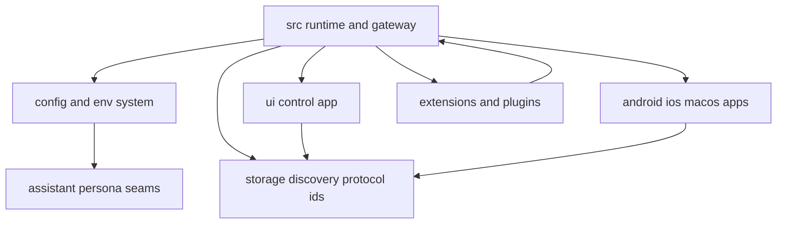
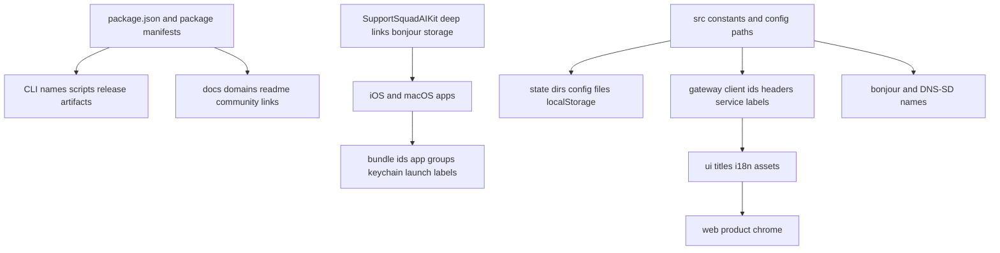

# Whitelabel Readiness Audit

## Executive Summary

This codebase is viable for a whitelabeled product, but it is not yet designed for a full product rename without compatibility work.

The strongest part of the architecture is the runtime config layer. The core Node/TypeScript gateway already exposes configurable seams for assistant identity, model/provider settings, plugin loading, gateway deployment, and some UI behavior. That makes a cosmetic or semi-structural rebrand feasible.

The main blocker is that `SupportSquadAI` and `supportsquadai` are embedded in runtime contracts, not just visible branding. Those identifiers currently appear in:

- package names and plugin metadata
- config filenames and state directories
- localStorage keys
- gateway client IDs
- mDNS / Bonjour service names
- deep-link URL schemes
- bundle IDs, launch labels, app groups, and keychain services
- release feeds, install URLs, docs domains, and community/support links

That means there are really two different whitelabel targets:

1. A ship-fast cosmetic/productized fork that changes visible branding, assets, copy, and packaging while preserving internal compatibility identifiers.
2. A full OEM-style rename that introduces a new brand identity layer and migration logic for storage, discovery, native app identity, and external contracts.

## Scope And Method

This audit covers the handwritten code in:

- `src`
- `ui`
- `apps/android`
- `apps/ios`
- `apps/macos`
- `apps/shared/SupportSquadAIKit`
- `extensions`
- `scripts`
- root package/deploy/docs metadata
- `assets/chrome-extension`
- `Swabble`

It excludes generated, vendored, or build-output directories such as `vendor`, `dist`, `node_modules`, Gradle/Xcode build outputs, coverage, and similar artifacts.

## High-Level Architecture



## Inventory By Surface

### Root Package, Docs, And Distribution

Primary package and release identity is strongly branded:

- `package.json`: package name `supportsquadai`, CLI bin `supportsquadai`, GitHub URLs, scripts, release/build naming.
- `README.md`: product title, logo, tagline, website/docs/community links, screenshots, brand narrative.
- `docs/docs.json`: docs site name `SupportSquadAI`, GitHub links, branded assets.
- `docs/CNAME`: `docs.supportsquadai.ai`.
- `SECURITY.md`: `security@supportsquadai.ai`, `trust.supportsquadai.ai`.
- `appcast.xml`: Sparkle feed title `SupportSquadAI`, release asset names.
- `docker-compose.yml`, `Dockerfile`, `.env.example`, `render.yaml`, `fly.toml`, `fly.private.toml`: service names, image names, mount paths, env namespaces, and deploy labels are all SupportSquadAI-branded.
- `.github/ISSUE_TEMPLATE/config.yml`, `.github/workflows/auto-response.yml`: support/community routing still targets the SupportSquadAI ecosystem.

Extension packages are also branded:

- `extensions/*/package.json`: package scope is `@supportsquadai/*`.
- `ui/package.json`: package name is `supportsquadai-control-ui`.
- `packages/clawdbot/package.json` and `packages/moltbot/package.json`: legacy shims remain for compatibility.

### Runtime And Gateway

The runtime has a good config foundation, but many identity constants are hardcoded:

- `src/config/types.supportsquadai.ts`: user-facing identity seam via `ui.assistant.name` and `ui.assistant.avatar`.
- `src/gateway/assistant-identity.ts`: assistant identity resolution is already abstracted and reusable.
- `src/config/io.ts`: config loading/writing is centralized and supports include/env/runtime layers.
- `src/config/paths.ts`: state dir `.supportsquadai`, config file `supportsquadai.json`, lock dir names, oauth storage, env override names, and legacy compatibility handling.
- `src/version.ts`: package identity and version env names remain SupportSquadAI-branded.
- `src/cli/cli-name.ts`: canonical CLI name is `supportsquadai`.
- `src/gateway/protocol/client-info.ts`: client IDs include `supportsquadai-control-ui`, `supportsquadai-macos`, `supportsquadai-ios`, `supportsquadai-android`, and `supportsquadai-probe`.
- `src/terminal/links.ts`: docs root is `https://docs.supportsquadai.ai`.
- `src/plugins/manifest.ts`: plugin manifest filename is `supportsquadai.plugin.json`.
- `src/plugins/loader.ts`: plugin SDK aliases use `supportsquadai/plugin-sdk`.
- `src/infra/bonjour.ts` and `src/infra/bonjour-discovery.ts`: Bonjour service naming uses `supportsquadai-gw` and `_supportsquadai-gw._tcp`.
- `src/infra/widearea-dns.ts`: wide-area DNS-SD naming is also SupportSquadAI-branded.
- `src/daemon/constants.ts`: service labels such as `ai.supportsquadai.gateway`, `supportsquadai-gateway`, and `SupportSquadAI Gateway`.
- `src/gateway/credentials.ts`, `src/pairing/setup-code.ts`: env-based auth/token identity uses `SUPPORTSQUADAI_*` names.

Operator-facing copy also leaks product identity:

- `src/wizard/onboarding.ts`
- `src/wizard/onboarding.finalize.ts`
- `src/commands/dashboard.ts`
- `src/commands/onboard-remote.ts`
- `src/pairing/pairing-messages.ts`
- `src/tui/tui.ts`

### Web Control UI

The web UI contains both cosmetic brand chrome and contract-level identifiers:

- `ui/index.html`: title `SupportSquadAI Control`; root element is `supportsquadai-app`; branded favicons and touch icons.
- `ui/src/ui/app.ts`: custom element name `supportsquadai-app`; bootstrap global `__SUPPORTSQUADAI_CONTROL_UI_BASE_PATH__`.
- `ui/src/ui/app-render.ts`: visible topbar branding, product title, subtitle, logo usage, and docs link.
- `ui/src/i18n/locales/en.ts` and translated locale files: visible product references, config path references, CLI examples, auth/onboarding copy.
- `ui/src/ui/views/overview.ts`: visible docs links and SupportSquadAI-specific instructions.
- `ui/src/ui/storage.ts`: localStorage key `supportsquadai.control.settings.v1`.
- `ui/src/i18n/lib/translate.ts`: locale key `supportsquadai.i18n.locale`.
- `ui/src/ui/device-identity.ts`: storage key `supportsquadai-device-identity-v1`.
- `ui/src/ui/device-auth.ts`: storage key `supportsquadai.device.auth.v1`.
- `ui/src/ui/controllers/usage.ts`: usage report storage key `supportsquadai.control.usage.date-params.v1`.
- `ui/src/ui/gateway.ts` and `ui/src/ui/app-gateway.ts`: client ID `supportsquadai-control-ui`.
- `ui/src/ui/views/usage.ts` and `ui/src/ui/app-scroll.ts`: downloaded filenames still start with `supportsquadai-`.

### Chrome Extension

The extension is separately branded and has its own runtime contract surfaces:

- `assets/chrome-extension/manifest.json`: name `SupportSquadAI Browser Relay`, description, default title, icon references, local host permissions.
- `assets/chrome-extension/options.html`: visible setup UI, SupportSquadAI copy, docs link, token instructions.
- `assets/chrome-extension/options.js`: request header `x-supportsquadai-relay-token`.
- `assets/chrome-extension/background.js`: user-facing action titles and internal extension storage keys.
- `assets/chrome-extension/README.md`: branded setup documentation.

### Android

Android branding is split across packaging, runtime identifiers, and user-facing copy:

- `apps/android/app/build.gradle.kts`: `applicationId` and `namespace` are `ai.supportsquadai.android`; APK naming uses `supportsquadai-...apk`.
- `apps/android/settings.gradle.kts`: root project name `SupportSquadAINodeAndroid`.
- `apps/android/app/src/main/AndroidManifest.xml`: app metadata, theme `Theme.SupportSquadAINode`, provider authority derived from package ID.
- `apps/android/app/src/main/res/values/strings.xml`: app label `SupportSquadAI Node`.
- `apps/android/app/src/main/res/xml/network_security_config.xml`: allows `supportsquadai.local`.
- `apps/android/app/src/main/java/ai/supportsquadai/android/gateway/GatewayDiscovery.kt`: `_supportsquadai-gw._tcp`.
- `apps/android/app/src/main/java/ai/supportsquadai/android/node/ConnectionManager.kt`: user agent `SupportSquadAIAndroid/...`, client IDs `supportsquadai-android` and `supportsquadai-control-ui`.
- Multiple UI files contain user-visible SupportSquadAI copy, notifications, and settings language.

### iOS

iOS has dense identity coupling across project structure, bundles, storage, and deep links:

- `apps/ios/project.yml`: app name `SupportSquadAI`, bundle prefix `ai.supportsquadai`, targets/schemes named `SupportSquadAI*`, display names, URL scheme `supportsquadai`, Bonjour `_supportsquadai-gw._tcp`.
- `apps/ios/Signing.xcconfig` and `apps/ios/Config/Signing.xcconfig`: bundle IDs for app, share extension, and watch targets.
- `apps/ios/Sources/Info.plist`: display names, URL registration, permissions text.
- `apps/ios/Sources/SupportSquadAIApp.swift`: background IDs, notification/action identifiers.
- `apps/ios/Sources/Gateway/GatewaySettingsStore.swift`: keychain services `ai.supportsquadai.gateway`, `ai.supportsquadai.node`, `ai.supportsquadai.talk`.
- `apps/ios/Sources/Onboarding/OnboardingWizardView.swift`: user-facing SupportSquadAI onboarding copy and default host `supportsquadai.local`.

### Shared Swift Kit

The shared kit is a high-leverage hotspot because both iOS and macOS depend on it:

- `apps/shared/SupportSquadAIKit/Package.swift`: package names `SupportSquadAIKit`, `SupportSquadAIProtocol`, `SupportSquadAIChatUI`.
- `apps/shared/SupportSquadAIKit/Sources/SupportSquadAIKit/DeepLinks.swift`: deep-link scheme `supportsquadai`, hosts `agent` and `gateway`.
- `apps/shared/SupportSquadAIKit/Sources/SupportSquadAIKit/BonjourTypes.swift`: discovery constants `_supportsquadai-gw._tcp` and `SUPPORTSQUADAI_WIDE_AREA_DOMAIN`.
- `apps/shared/SupportSquadAIKit/Sources/SupportSquadAIKit/StoragePaths.swift`: on-disk `SupportSquadAI` application support and caches paths.
- `apps/shared/SupportSquadAIKit/Sources/SupportSquadAIKit/ShareToAgentSettings.swift` and `ShareGatewayRelaySettings.swift`: shared defaults/app-group style identity uses `group.ai.supportsquadai.shared`.

### macOS

macOS identity spans package naming, app bundle identity, launch agents, sockets, and defaults keys:

- `apps/macos/Package.swift`: package name `SupportSquadAI`; executables `SupportSquadAI` and `supportsquadai-mac`.
- `apps/macos/Sources/SupportSquadAI/Resources/Info.plist`: bundle ID `ai.supportsquadai.mac`, URL scheme `supportsquadai`, icon file `SupportSquadAI`, visible app name.
- `apps/macos/Sources/SupportSquadAI/Constants.swift`: launch labels and defaults key namespaces under `supportsquadai.*`.
- `apps/macos/Sources/SupportSquadAI/SupportSquadAIPaths.swift`: `~/.supportsquadai/supportsquadai.json`.
- `apps/macos/Sources/SupportSquadAIIPC/IPC.swift`: `Application Support/SupportSquadAI/control.sock`.
- `apps/macos/Sources/SupportSquadAIMacCLI/EntryPoint.swift` and related files: CLI binary `supportsquadai-mac`, client ID `supportsquadai-macos`, user-facing command descriptions.
- `apps/macos/Sources/SupportSquadAIDiscovery/GatewayDiscoveryModel.swift`: strips `" (SupportSquadAI)"` from service names.

### Swabble

`Swabble` is a distinct secondary brand with its own storage and service identity:

- `Swabble/Package.swift`: package/product names `swabble`, `Swabble`, `SwabbleKit`.
- `Swabble/Sources/swabble/Commands/ServiceCommands.swift`: launchd label `com.swabble.agent`.
- `Swabble/Sources/SwabbleCore/Config/Config.swift`: default wake word and branded defaults.
- `Swabble/Sources/SwabbleCore/Support/TranscriptsStore.swift`: storage path branding.

If Swabble remains part of the shipped product, it needs its own whitelabel strategy instead of being treated as neutral infrastructure.

## Classification

### Cosmetic

These can be changed with relatively low technical risk because they are user-visible but not core runtime contracts:

- logos, favicons, app icons, screenshots, docs art
- README and docs marketing copy
- web page title and topbar title
- dashboard subtitles and help copy
- Android/iOS/macOS visible app names and notification text
- exported filename prefixes such as `supportsquadai-usage-...`
- release artifact display titles and appcast feed title

Representative files:

- `ui/index.html`
- `ui/src/ui/app-render.ts`
- `ui/src/i18n/locales/en.ts`
- `apps/android/app/src/main/res/values/strings.xml`
- `apps/ios/project.yml`
- `apps/macos/Sources/SupportSquadAI/Resources/Info.plist`
- `README.md`
- `docs/docs.json`
- `appcast.xml`

### Contract-Level

These are used by code, storage, build systems, or integrations. Renaming them is possible, but not free:

- CLI bin names and script names
- package names and `@supportsquadai/*` npm scope
- env var namespaces such as `SUPPORTSQUADAI_*`
- config filenames and state directories such as `~/.supportsquadai/supportsquadai.json`
- localStorage keys such as `supportsquadai.control.settings.v1`
- gateway client IDs such as `supportsquadai-control-ui`
- extension header `x-supportsquadai-relay-token`
- APK naming and image names
- plugin manifest name `supportsquadai.plugin.json`
- launchd labels, systemd unit names, Docker service names

Representative files:

- `package.json`
- `src/config/paths.ts`
- `src/gateway/protocol/client-info.ts`
- `src/plugins/manifest.ts`
- `src/plugins/loader.ts`
- `ui/src/ui/storage.ts`
- `ui/src/ui/device-auth.ts`
- `assets/chrome-extension/options.js`
- `apps/android/app/build.gradle.kts`
- `apps/macos/Sources/SupportSquadAI/Constants.swift`

### Migration-Required

These are rename points that risk breakage for existing installs, discovery, auth, or inter-app communication:

- URL scheme `supportsquadai`
- Bonjour service `_supportsquadai-gw._tcp`
- local hostnames like `supportsquadai.local`
- app group / shared suite identifiers such as `group.ai.supportsquadai.shared`
- bundle IDs and package IDs such as `ai.supportsquadai.*`
- keychain service identifiers such as `ai.supportsquadai.gateway`
- launch labels and plist paths
- on-disk storage roots like `~/.supportsquadai` and `Application Support/SupportSquadAI`
- persisted defaults keys under `supportsquadai.*`
- gateway client IDs if server or native clients assume them across versions

Representative files:

- `apps/shared/SupportSquadAIKit/Sources/SupportSquadAIKit/DeepLinks.swift`
- `apps/shared/SupportSquadAIKit/Sources/SupportSquadAIKit/BonjourTypes.swift`
- `apps/shared/SupportSquadAIKit/Sources/SupportSquadAIKit/StoragePaths.swift`
- `apps/ios/project.yml`
- `apps/ios/Sources/Gateway/GatewaySettingsStore.swift`
- `apps/macos/Sources/SupportSquadAI/SupportSquadAIPaths.swift`
- `apps/macos/Sources/SupportSquadAIIPC/IPC.swift`
- `src/config/paths.ts`
- `src/infra/bonjour.ts`
- `src/infra/bonjour-discovery.ts`

## Identity Flow

Product identity currently flows from multiple entry points instead of a single brand configuration object.



In practice, the system has five separate identity layers today:

1. Visible brand layer: titles, logos, copy, and docs.
2. Runtime config layer: assistant persona and some gateway/UI behavior.
3. Storage layer: state directories, filenames, browser storage keys, defaults keys.
4. Discovery/protocol layer: client IDs, Bonjour service names, deep links, headers.
5. Native platform layer: bundle IDs, keychain groups, app groups, launch agents, package IDs.

That fragmentation is the main reason a full rename is harder than a cosmetic rebrand.

## Existing Whitelabel-Friendly Seams

The codebase already has several good seams that reduce the need for hard forks:

### Runtime Config

- `src/config/io.ts`
- `src/config/includes.ts`
- `src/config/env-substitution.ts`
- `src/config/env-vars.ts`
- `src/config/runtime-overrides.ts`

These support layered configuration, environment injection, and runtime overrides, which is strong groundwork for per-brand or per-tenant deployments.

### Assistant Persona

- `src/config/types.supportsquadai.ts`
- `src/gateway/assistant-identity.ts`

The assistant display name and avatar already have a dedicated abstraction and are good candidates for becoming part of a broader brand config.

### Plugin And Extension System

- `src/plugins/manifest.ts`
- `src/plugins/loader.ts`
- `src/plugins/manifest-registry.ts`
- `src/config/schema.ts`

This is useful for tenant-specific features, integrations, or brand-dependent capabilities. The main issue is that plugin packaging and manifest naming still use SupportSquadAI-specific identifiers.

### Gateway Deployment

- `src/config/types.gateway.ts`
- `src/gateway/server-runtime-config.ts`
- `ui/vite.config.ts`

The gateway base path, control UI hosting shape, and some deployment characteristics are already configurable, which helps with branded hosting and reverse-proxy setups.

### Localization

- `ui/src/i18n/locales/*`

The web UI is already localized, which is a good foundation for centralizing product text. The limitation is that much CLI, onboarding, native, and operational copy is still hardcoded elsewhere.

## Main Risks

### Safe For A Near-Term Rebrand

- Replace logos, icons, page titles, docs branding, community links, screenshots, and visible SupportSquadAI copy.
- Override assistant name/avatar and other presentation-level identity through config where possible.
- Repackage deploy manifests and distribution labels without changing persistent IDs yet.

### Risky Without Migration

- Renaming `~/.supportsquadai`, `supportsquadai.json`, or browser storage keys.
- Renaming `supportsquadai-control-ui` and other client IDs used during gateway connection.
- Renaming `_supportsquadai-gw._tcp` or `supportsquadai.local`.
- Renaming `supportsquadai` deep links.
- Renaming `ai.supportsquadai.*` bundle IDs, shared suites, or keychain services.
- Renaming package scopes and plugin manifest filenames used by tooling.

### Hidden Coupling

- Legacy aliases (`CLAWDBOT_*`, `.clawdbot`, `.moltbot`) show that compatibility concerns already exist and will grow if another rename is layered on top without a formal migration system.
- Shared Swift kit constants are imported by both iOS and macOS, so even a "mobile-only" rename touches shared contracts.
- The extension has its own branded header and setup flow, so browser relay functionality needs an explicit migration path too.
- `Swabble` is a separate brand and can leak into the product even after SupportSquadAI-specific UI changes.

## Recommended Strategy

### Phase 1: Ship-Fast Cosmetic Rebrand

Goal: launch your own branded variant quickly while minimizing regression risk.

Do:

- replace visible product names and logos across web, docs, README, assets, app names, app icons, notifications, and release artifacts
- change website/docs/support/community links
- make assistant persona defaults match your brand
- update deploy manifests and packaging names used by customers

Do not rename yet:

- `SUPPORTSQUADAI_*` env vars
- `~/.supportsquadai` state paths
- `supportsquadai` localStorage keys
- `supportsquadai-control-ui` and related client IDs
- `_supportsquadai-gw._tcp`
- `supportsquadai` deep links
- `ai.supportsquadai.*` bundle IDs unless you are shipping a separate app-store identity and can handle the implications

### Phase 2: Structural Productization

Goal: stop future forks from scattering brand strings throughout the codebase.

Introduce a first-class brand identity layer with fields such as:

- product display name
- short machine name
- docs/support/community URLs
- web title and subtitle
- asset references
- assistant defaults
- optional extension/app titles
- optional export filename prefix

Then route web UI, onboarding, docs links, and native visible copy through that layer where practical.

### Phase 3: Full Rename With Migration

Goal: support a genuine OEM or independent product identity.

Add explicit migrations for:

- state directory and config filename fallback/upgrade
- browser localStorage key migration
- native defaults/keychain/app-group migration
- deep-link dual-registration during transition
- Bonjour dual-discovery or compatibility aliasing
- bundle ID / package ID strategy
- gateway client ID compatibility

This phase should be treated as a compatibility project, not a search-and-replace.

## Suggested Brand Abstraction

Create a single runtime brand descriptor used by the gateway, UI, and native apps wherever possible.

Suggested fields:

```ts
type BrandConfig = {
  displayName: string;
  machineName: string;
  webTitle: string;
  webSubtitle?: string;
  docsUrl: string;
  supportUrl?: string;
  communityUrl?: string;
  assistant: {
    name: string;
    avatar?: string;
  };
  exportPrefix?: string;
  assets?: {
    logo?: string;
    favicon?: string;
    appIcon?: string;
  };
};
```

Important: this brand config should not automatically replace migration-sensitive IDs. Runtime contracts need a separate compatibility policy.

## Highest-Leverage Files To Tackle First

If the goal is maximum whitelabel impact with minimum initial churn, start here:

- `package.json`
- `README.md`
- `docs/docs.json`
- `SECURITY.md`
- `ui/index.html`
- `ui/src/ui/app-render.ts`
- `ui/src/i18n/locales/en.ts`
- `ui/src/ui/views/overview.ts`
- `src/config/types.supportsquadai.ts`
- `src/gateway/assistant-identity.ts`
- `src/terminal/links.ts`
- `apps/ios/project.yml`
- `apps/android/app/build.gradle.kts`
- `apps/android/app/src/main/res/values/strings.xml`
- `apps/macos/Sources/SupportSquadAI/Resources/Info.plist`
- `assets/chrome-extension/manifest.json`
- `assets/chrome-extension/options.html`

If the goal is a true product rename, these are the most sensitive hotspots:

- `src/config/paths.ts`
- `src/gateway/protocol/client-info.ts`
- `src/infra/bonjour.ts`
- `src/infra/bonjour-discovery.ts`
- `apps/shared/SupportSquadAIKit/Sources/SupportSquadAIKit/DeepLinks.swift`
- `apps/shared/SupportSquadAIKit/Sources/SupportSquadAIKit/BonjourTypes.swift`
- `apps/shared/SupportSquadAIKit/Sources/SupportSquadAIKit/StoragePaths.swift`
- `apps/ios/Sources/Gateway/GatewaySettingsStore.swift`
- `apps/macos/Sources/SupportSquadAI/Constants.swift`
- `ui/src/ui/storage.ts`
- `ui/src/ui/device-auth.ts`
- `ui/src/ui/device-identity.ts`

## Bottom Line

This repository is ready for a controlled whitelabeling effort, but not for a blind global rename.

The best path is:

1. rebrand visible surfaces first
2. centralize brand/config-driven presentation
3. only then introduce contract migrations for storage, discovery, protocols, and native identifiers

If you want your own product quickly, keep internal SupportSquadAI compatibility IDs for the first release and change what customers actually see. If you want a fully independent product line, budget for a second phase focused entirely on migrations and compatibility.
